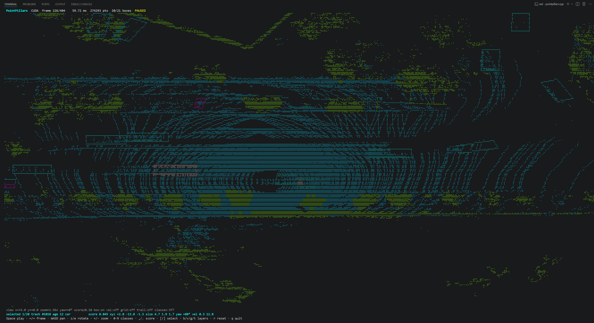

# pointpillars.c

**A native C11 inference runtime for the OpenPCDet nuScenes PointPillars MultiHead checkpoint.**

`pointpillars.c` runs the frozen 190-tensor model on Linux, WSL, and macOS. It
includes strict CPU backends, custom CUDA and cuDNN paths, deterministic model
conversion, official nuScenes evaluation tools, reproducible performance
reports, and a live terminal point-cloud viewer.



## Why this project

- **One exact model contract.** The runtime reproduces the checkpoint's PFN,
  512×512 BEV backbone, six multi-head predictors, velocity decode, and rotated
  per-class NMS.
- **Native on Apple Silicon.** macOS builds automatically use Accelerate/BNNS
  for oracle-safe shapes and the canonical C kernel for the one rejected shape.
- **Fast on NVIDIA GPUs.** Choose dependency-light custom CUDA or strict FP32
  cuDNN; compact detection avoids transferring the full 14.75 MiB raw output.
- **Evidence, not anecdotes.** JSON reports identify the model, point fixture,
  executable, machine, environment, cold run, warm distribution, memory, and
  output boundary.
- **Portable and inspectable.** The core is C11/POSIX, the model is a mapped
  CRC-checked FP32 container, and every optimized operator has a fallback.

## Quick start

Download `pp_multihead_nds5823_updated.pth` into `ckpts/`, then choose the
workflow for your platform.

### macOS (Apple Silicon or Intel)

No Homebrew OpenMP package is required. The default build links Apple's system
Accelerate framework and uses BNNS convolution plans with a strict FP32 gate.

```sh
make setup-model
make model PYTHON=.venv/bin/python
make
make test PYTHON=.venv/bin/python

./build/pointpillars inspect nuscenes_multihead.ppw
./build/pointpillars infer \
  nuscenes_multihead.ppw /path/to/prepared-frame.bin result.ppout 5 boxes.json
```

### Linux / WSL

The default CPU build uses OpenMP and enables the host ISA through
`-march=native`.

```sh
make setup-model
make model PYTHON=.venv/bin/python
make
make test PYTHON=.venv/bin/python

OMP_NUM_THREADS=16 ./build/pointpillars infer \
  nuscenes_multihead.ppw /path/to/prepared-frame.bin result.ppout 5 boxes.json
```

Python, PyTorch, NumPy, and PyYAML are required only for the offline `.pth` to
`.ppw` conversion. The resulting inference binary has no Python dependency.
Override `CHECKPOINT`, `CONFIG`, `MODEL`, or `PYTHON` when using custom paths.

## Backends

| Target | Platform | Math contract | Notes |
|---|---|---|---|
| `make` | macOS | FP32, checkpoint-oracle allclose | Accelerate/BNNS + strict C shape fallback |
| `make` | Linux/WSL | FP32, checkpoint-oracle allclose | OpenMP + AVX2/FMA when available |
| `make ggml` | Linux/WSL | FP32, checkpoint-oracle allclose | pinned, shape-selected GGML hybrid |
| `make cuda` | Linux/WSL + NVIDIA | approximate by default | custom WMMA; `PP_CUDA_PRECISE=1` is strict |
| `make cudnn` | Linux/WSL + NVIDIA | strict FP32 by default | fastest measured strict NVIDIA backend |

CUDA is not available on macOS. Apple builds use the CPU/Accelerate path; the
same CLI modes (`infer`, `bench`, `batch`, and `tui`) work without CUDA.

## Prepare nuScenes input

Raw nuScenes lidar files store ring index in the fifth float, while this model
expects sweep time. Prepare OpenPCDet-compatible ten-sweep frames once:

```sh
python3 tools/prepare_nuscenes.py \
  --root /data/nuscenes \
  --output /data/nuscenes/pointpillars_10sweep
```

Each prepared point is `[x, y, z, intensity, time_lag]`. The converter applies
ego filtering, calibrated sensor/ego/global transforms, intensity
normalization, time-lag construction, and deterministic test-time shuffling.

The implemented model contract is:

- range `[-51.2, -51.2, -5, 51.2, 51.2, 3]`;
- voxel size `0.2 × 0.2 × 8`;
- up to 30,000 pillars and 20 points per pillar;
- 11-feature PFN and `64 × 512 × 512` scatter;
- three-stage BEV backbone and `384 → 64` shared convolution;
- six heads over ten nuScenes classes;
- `cls/reg/height/size/sincos-angle/velocity` branches;
- score filtering and rotated NMS at the canonical C decode boundary.

## Run inference, batch, and TUI

```sh
frame=$(find /data/nuscenes/pointpillars_10sweep \
  -name '*.bin' -type f | sort | head -1)

# One frame: raw tensors plus decoded JSON.
./build/pointpillars infer \
  nuscenes_multihead.ppw "$frame" result.ppout 5 boxes.json

# Directory batch inference.
./build/pointpillars batch \
  nuscenes_multihead.ppw /data/nuscenes/pointpillars_10sweep build/detections

# Interactive ANSI/Braille bird's-eye viewer.
./build/pointpillars tui \
  nuscenes_multihead.ppw /data/nuscenes/pointpillars_10sweep
```

Batch mode overlaps preparation of the next frame with current inference using
a bounded two-frame pipeline. Set `PP_NO_PREFETCH=1` for memory-constrained
runs or a no-overlap A/B measurement.

The TUI supports pause/step, pan, rotation, zoom, class filters, score control,
box and velocity layers, trails, object inspection, resize, and reliable
terminal restoration. Use `Space`, arrows or `p`/`n`, `WASD`, `z`/`e`,
`+`/`-`, `0`–`9`, `,`/`.`, `[`/`]`, `b`/`v`, `g`/`t`, `r`, and `q` to
control the view.

## Reproducible benchmarks

```sh
make perf-cpu PERF_FRAME="$frame" PERF_REPS=20 PERF_THREADS=16 \
  PYTHON=.venv/bin/python

python3 tools/perf.py compare baseline.json candidate.json \
  --stat median --max-regression 0
```

The macOS result below uses a deterministic 24,000-point / 7,881-pillar
synthetic fixture on an 8-core Apple M2. Ten strict-hybrid runs were captured,
three warmups were excluded, and the raw 3,866,624-float output was checked directly against
the PyTorch checkpoint.

| Apple M2 CPU path | Warm median | p95 | Oracle max abs | Result |
|---|---:|---:|---:|---|
| portable C fallback | 7017.255 ms | 7029.027 ms | `6.75e-5` | strict |
| Accelerate/BNNS strict hybrid | **249.490 ms** | **253.699 ms** | `6.51e-5` | strict, **28.1× faster** |
| all-BNNS experiment | 181.041 ms | 186.170 ms | `2.12` | rejected, not default |

The rejected row is important: BNNS' `2×2/stride-2` convolution was fast but
failed the raw graph oracle. The promoted path keeps that single shape on the
canonical C implementation. `PP_APPLE_CONV2=1` exists only to reproduce the
approximate experiment; `PP_APPLE_DISABLE=1` restores the full portable path.

Reference WSL measurements use a different real nuScenes fixture and therefore
must not be compared directly with the M2 rows:

| i5-14600KF / RTX 4060 Ti path | Warm latency |
|---|---:|
| native CPU, tuned 32 workers | 410.406 ms raw |
| custom CUDA WMMA | 44.397 ms raw / 44.104 ms compact |
| cuDNN FP32/FMA | 12.993 ms raw / 12.160 ms compact |

See the [performance workflow](wiki/11-performance-workflow.md) for fixture
identity, stage timing, memory/transfer gates, and rejected experiments.

## NVIDIA commands

```sh
make cuda
make cudnn
make cudnn-test

./build/pointpillars_cuda bench-cuda nuscenes_multihead.ppw "$frame" 20
./build/pointpillars_cudnn bench-detect-cuda \
  nuscenes_multihead.ppw "$frame" 20
```

CUDA batch/TUI modes compact score-qualified candidates on-device and run the
same canonical C decode/NMS. `PP_CUDA_RAW_DECODE=1` restores the full tensor
transfer for differential testing. `PP_CUDNN_DISABLE=1` falls back to custom
CUDA; `PP_CUDNN_TF32=1` is an explicitly approximate experiment.

## Validation

```sh
make test PYTHON=.venv/bin/python
make portable-test PYTHON=.venv/bin/python
make checkpoint-oracle PYTHON=.venv/bin/python PERF_FRAME="$frame"
make checkpoint-oracle-ggml PYTHON=.venv/bin/python
make checkpoint-oracle-cuda PYTHON=.venv/bin/python
make checkpoint-oracle-cudnn PYTHON=.venv/bin/python
```

Validation is a funnel: model-container safety, deterministic operator
fixtures, full raw-graph comparison, decoded output comparison, then official
task evaluation. A faster approximate backend cannot borrow the correctness
claim of its strict fallback.

## Official nuScenes evaluation

```sh
./build/pointpillars_cudnn batch-cuda \
  nuscenes_multihead.ppw /data/nuscenes/pointpillars_10sweep build/detections

python3 tools/make_submission.py \
  build/detections /data/nuscenes/pointpillars_10sweep/manifest.json \
  evaluation/nuscenes_submission.json

python3 tools/evaluate_nuscenes.py evaluation/nuscenes_submission.json \
  --output evaluation/nuscenes-mini
```

The checked local 81-frame `mini_val` result is mAP `0.2055` and NDS `0.3280`.
It is not directly comparable with the checkpoint filename's `5823`, which
comes from a different/full evaluation context.

## Repository guide

| Path | Purpose |
|---|---|
| `src/infer_cpu.c` | portable C, OpenMP, and AVX2 operator/runtime path |
| `src/infer_apple.c` | cached Accelerate/BNNS adapter and strict shape gate |
| `src/infer_cuda.cu` | persistent custom CUDA/WMMA backend |
| `src/infer_cudnn.cu` | cached strict FP32 cuDNN backend |
| `src/voxel.c` | point loading and deterministic pillar construction |
| `src/decode.c` | branch decode, residual geometry, and rotated NMS |
| `tools/perf.py` | identified benchmark capture and regression comparison |
| `tools/oracle_checkpoint.py` | independent PyTorch raw-graph oracle |
| `wiki/` | illustrated architecture and performance documentation |

Start with the [systems performance wiki](wiki/Home.md), then use the
[Apple Silicon guide](wiki/12-macos-apple-silicon.md) or the
[extension map](wiki/10-extension-guide.md) for backend work.

## License

See [LICENSE](LICENSE).
