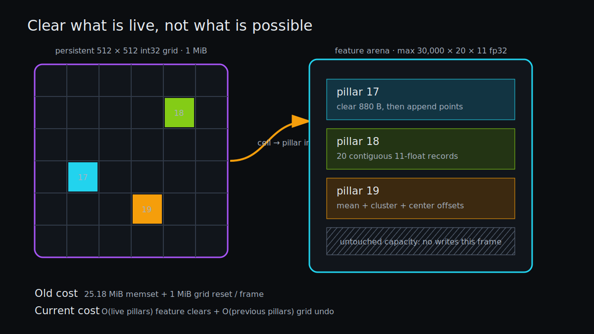

# From Ten Sweeps to Sparse Pillars

> **Outcome.** Voxelization is a single pass over points followed by a single pass over live pillars. Its key optimization is almost embarrassingly simple: clear the 880-byte feature block when a pillar is created, and undo only the grid cells touched by the previous frame. Work now scales with live pillars instead of the 30,000-pillar capacity.



*The 1 MiB spatial index is persistent; compact feature rows are initialized only when they become live.*

## The direct-address map

[`pp_voxelize`](../src/voxel.c) maps a point to integer coordinates:

```c
int ix = (int)((x - X_MIN) / VX);
int iy = (int)((y - Y_MIN) / VY);
size_t cell = (size_t)iy * PP_GRID_X + ix;
int pi = grid[cell];
```

The grid is a `512 × 512` array of `int32_t`, or exactly 1 MiB. This direct-address table avoids hashing and pointer-rich buckets. A spatially shuffled input does make grid reads effectively scattered across that 1 MiB region—larger than private L2 on some CPUs—but every lookup is one predictable address and the whole structure fits comfortably in the 24 MiB shared L3 of the measured i5-14600KF.

The output feature arena is compact by creation order. Once `pi` is known, points in the same pillar land in one 20×11 row block. That gives good locality for the later mean/offset pass even though the spatial grid accesses were irregular.

## The write budget

The naive reset strategy would write:

```text
feature capacity  30,000 × 20 × 11 × 4 B = 25.18 MiB
coordinates       30,000 × 4 × 4 B       = 0.46 MiB
point counts      30,000 × 1 B           = 0.03 MiB
grid              512 × 512 × 4 B        = 1.00 MiB
```

Most of those bytes describe pillars that do not exist in the current frame. The current implementation instead:

1. walks the previous frame's compact coordinate list and writes `-1` to only those grid cells;
2. clears one `20 × 11 × 4 B = 880 B` feature block when a new pillar appears;
3. overwrites coordinates and point count for that new row.

For the 7,868-pillar reference frame, feature clearing is about 6.60 MiB rather than 25.18 MiB. The grid undo is 7,868 integer stores rather than 262,144.

## Feature construction locality

After point assignment, the code visits pillars in compact order. The first inner loop sums XYZ for up to 20 points; the second writes cluster and center offsets. Each pillar block is only 880 bytes, so both passes reuse data that should remain in L1. The 11-float point record is 44 bytes: it does not align perfectly with a 64-byte cache line, but sequential point traversal still consumes every loaded byte.

Unused point slots must remain zero because PFN always evaluates all 20 slots. Clearing at pillar creation preserves that semantic without touching inactive capacity.

> **Sidenote — zero padding is part of the model.** Skipping the clear would not merely leak old memory into a debug view; stale point features would enter a linear layer and change max pooling.

## File loading and page behavior

[`pp_load_points`](../src/voxel.c) validates that file size is divisible by `5 × sizeof(float)`, allocates one exact-size buffer, and uses `fread`. Batch mode overlaps this load and voxelization with the previous frame's GPU inference through the bounded producer in [`src/main.c`](../src/main.c). That overlap is useful even when the filesystem page cache makes reads cheap: feature construction still consumes CPU cycles and memory bandwidth.

The loader deliberately stays simple. `mmap` or direct I/O would need evidence: frames are a few MiB, sequentially read once, and the operating-system page cache already performs readahead.

## Capacity and malformed input

- Points outside the 3D range increment `clipped_points`.
- A full 20-point pillar silently ignores later points for that pillar, matching the configured capacity.
- Once 30,000 pillars exist, new cells increment `dropped_pillars`.
- A malformed byte count or wrong runtime stride fails before voxelization.

[`tests/test_voxel.c`](../tests/test_voxel.c) checks clipping, cluster offsets, absolute features, coordinate layout, and—importantly—reuse across a second frame so stale rows cannot survive.

## What to remember

- A dense direct-address index can be the fastest representation even for sparse output when its full size is only 1 MiB.
- Reset cost should scale with the set of touched entries, not maximum capacity.
- Data is spatially random during lookup but compact and cache-friendly during feature construction; one stage can deliberately change locality for the next.

## What remains

The point loop is scalar. SIMD is awkward because pillar creation is stateful and scattered, but batching coordinate tests or using a two-pass cell-key pipeline remains a measurable hypothesis. Any parallel version must preserve deterministic capacity behavior and avoid races when multiple points target the same cell.
