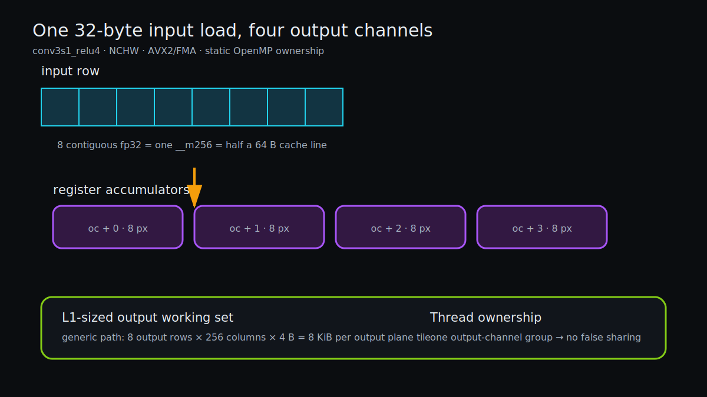

# The CPU Path: Reuse Before Representation

> **Outcome.** The native AVX2/FMA backend reaches a 468.816 ms warm median at the reproducible 16-thread setting and 410.406 ms at the host-tuned 32-worker setting. A pinned GGML hybrid reaches 458.973 ms at 16 threads, but loses at 32. The winning design is therefore not “use one library everywhere”; it is bounded NCHW storage plus per-shape kernel selection backed by scalar oracles.

*Eight adjacent x positions are reused across eight output-channel accumulators. Output ownership keeps reductions private and creates enough `(channel_block,row)` tasks for OpenMP.*

## Start with the lifetime graph

The CPU workspace contains:

| Buffer | Capacity |
|---|---:|
| PFN pillar output `64×P` | 1.92 MiB |
| Scatter `64×512×512` | 64.00 MiB |
| Two stage buffers | 32.00 MiB |
| Deblock output / concatenated feature arena | 24.00 MiB |
| Shared + middle scratch | 8.00 MiB |
| **Total** | **129.92 MiB** |

The 23.19 MiB read-only model mapping and 14.75 MiB raw host output are separate from the reported inference workspace. Stage activations ping-pong because each convolution kills its predecessor. The three deblocks write directly into consecutive thirds of the `384×128×128` shared-input arena, so concatenation is a layout decision rather than a 24 MiB allocation and copy.

That alias was the first important optimization: it reduced both CPU and CUDA memory and removed cache/device traffic before touching arithmetic.

## PFN and scatter are bounded but irregular

PFN assigns independent `(pillar, output_channel)` pairs. Each pair evaluates 20 points × 11 features and retains the ReLU maximum. The 44-byte weight row stays hot, while point records are visited sequentially. On the perf fixture PFN is about 2 ms, not the dominant CPU stage.

Scatter gives each worker an output-channel plane and walks live pillars. There is no cross-thread reduction or false sharing, but the shuffled `(y,x)` destinations have poor spatial locality. Clearing the dense 64 MiB canvas is unavoidable for this dense downstream graph; sparse writes only replace occupied cells.

## Generic convolution: choose ownership before intrinsics

The generic fallback owns one output channel and processes a bounded row tile while iterating input channels and nine taps. Partial outputs remain close to L1 and are written once per completed reduction. This loop order may reload inputs across output channels, but it avoids repeatedly spilling a full output plane and needs no lock or reduction buffer.

The fallback is deliberately retained. It is the portability path, the odd-shape path, and a differential reference for every wider kernel.

## Stride one: eight outputs share one AVX2 load

`conv3s1_relu8` handles output-channel multiples of eight. The hot loop loads eight adjacent FP32 input positions once, broadcasts eight scalar weights, and updates eight independent `__m256` accumulators with FMA. One input cache line therefore feeds 64 output values before eviction.

Interior pixels use a padding-free vector loop. Boundary columns use a scalar path, making branch cost proportional to the perimeter rather than the image area. Work is collapsed over `(eight-channel block,row)`, which preserves parallelism when a layer has only 64 output channels.

`PP_CPU_OC4=1` restores the four-output implementation for same-binary A/B. On the controlled 16-thread run, eight-channel stride-one processing improved total latency by about 5.8% relative to that fallback while producing byte-identical full output for the tested graph.

## Stride two: share the gather too

Adjacent outputs read input x positions two floats apart, so a contiguous load cannot represent the logical vector. `conv3s2_relu8` uses an AVX2 gather for `[0,2,4,…,14]` and shares that gather across eight output channels.

Gather remains more expensive than a unit-stride load; widening does not erase the physical layout. It does amortize address generation and input traffic. `PP_CPU_S2OC4=1` restores the narrower stride-two path. Same-binary measurements improved total latency by about 3.0% and backbone time by about 5.1%, with byte-identical graph output.

## Final heads: reduce once, write once

The old plain-output convolution accumulated one kernel tap at a time into memory. Final branches have only 2–12 output channels, so parallelizing only by channel left most workers idle and repeatedly loaded/stored the same output.

The direct plain kernels collapse `(channel_group,row)`, accumulate all input channels and taps in registers, add bias once, and write once. Specialized groups cover one, two, four, or eight output channels. The widest valid group is selected by divisibility; `PP_CPU_PLAIN_ACCUM` and `PP_CPU_PLAIN_OC{1,2,4}` expose every fallback.

The optimized path changes floating-point association but not the graph contract. Compared with the old accumulation path, raw maximum delta was `1.526e-5`; the PyTorch checkpoint oracle remains allclose with sub-`1e-3` maximum error. Head time fell from roughly 143 ms to about 123 ms in the controlled A/B sequence.

## Operator fixtures make widening safe

[`tests/test_cpu_conv.c`](../tests/test_cpu_conv.c) uses a deterministic scalar oracle for:

- small padding edges;
- odd widths and heights;
- stride one and stride two;
- ReLU and plain output;
- representative 64-channel shapes.

The largest observed fixture error is `5.96e-7`. These fixtures test indexing and boundary ownership independently of the full model and are run by both `make test` and `make portable-test`.

## GGML is a two-shape accelerator, not a model format requirement

`make ggml` builds official ggml `v0.16.0` at a pinned commit. [`src/infer_ggml.c`](../src/infer_ggml.c) creates two thread-local, fixed-shape graphs for:

- `64→128`, input `256×256`, stride 2;
- `128→256`, input `128×128`, stride 2.

Input, OIHW weight, and output tensors point directly at existing runtime buffers. The graph has no allocator-owned tensor data, and one bounded thread-local work buffer is shared between shapes. Bias and ReLU remain in the C runtime. `PP_GGML_DISABLE=1` restores native convolution.

Representative per-shape probes explain the selective dispatch:

| Shape | Result |
|---|---|
| `64→64 @ 512²/s2` | native wins |
| `64→64 @ 256²/s1` | native wins |
| `64→128 @ 256²/s2` | GGML wins |
| `128→256 @ 128²/s2` | GGML wins |
| `384→64 @ 128²/s1` | native wins |

At 16 threads the hybrid reduces total median from 468.816 to 458.973 ms (`-2.10%`) and increases capacity from 129.92 to 147.92 MiB. At the tuned 32-worker setting, native is 410.406 ms and GGML is 415.312 ms. Thread topology changes the library crossover, so explicit reports are safer than an opaque heuristic.

GGUF was not added as a second container. The existing `.ppw` already supplies aligned, CRC-checked, mmap-accessible, offline-folded FP32 tensors for a frozen CNN. GGUF would be useful for a broader metadata/interchange contract, but the file extension alone cannot improve a convolution kernel.

## Why quantization was not promoted

Fake PTQ screens covered per-output INT8 weights and quantized activations. Weight-only INT8 produced about `0.314` mean raw error and a maximum near `78.6`; activation-plus-weight schemes were similarly outside the oracle tolerance. Without calibration, quantization-aware training, and task evaluation, replacing FP32 would exchange a proven graph for an unbounded accuracy change.

The repository therefore keeps FP32 as the CPU correctness contract. A future low-bit path must first pass saved per-operator fixtures, then the raw graph oracle, then decoded and task-accuracy gates.

## Measured stage split

Twenty-run reports on the same fixture:

| Path | PFN | Scatter | Backbone | Heads | Total |
|---|---:|---:|---:|---:|---:|
| native, 16 threads | 2.046 | 2.828 | 338.347 | 123.793 | 468.816 ms |
| GGML hybrid, 16 threads | 2.019 | 2.842 | 330.170 | 122.747 | 458.973 ms |
| native, tuned 32 workers | 2.205 | 2.781 | 281.895 | 123.430 | 410.406 ms |

The graph performs a source-derived 133.57 GFLOP. Dividing by total latency is useful only as a whole-graph comparison: allocation, gathers, index arithmetic, ReLU, cache misses, and scheduling remain inside the denominator.

The CPU profile closes `backbone_ms` before the shared convolution; CUDA closes it after shared. Compare backend totals directly, but do not compare stage labels without accounting for that boundary.

## Portability and controls

`make portable-test` rebuilds with `OMP=0`. `-march=native` enables AVX2/FMA on the reference host; a distributable binary should lower the ISA baseline or add runtime dispatch.

| Switch | Restored behavior |
|---|---|
| `PP_CPU_OC4=1` | four-output stride-one ReLU kernel |
| `PP_CPU_S2OC4=1` | four-output stride-two gather kernel |
| `PP_CPU_PLAIN_ACCUM=1` | memory-accumulating plain convolution |
| `PP_CPU_PLAIN_OC4=1` | cap direct plain groups at four outputs |
| `PP_CPU_PLAIN_OC2=1` | cap at two outputs |
| `PP_CPU_PLAIN_OC1=1` | cap at one output |
| `PP_GGML_DISABLE=1` | native convolution in the GGML binary |

## What to remember

- Lifetimes and output ownership determine whether SIMD has useful data reuse.
- Widening a kernel must preserve enough parallel tasks for the actual channel counts.
- Library selection is an operator-and-topology decision, not a repository-wide ideology.
- Quantization needs an accuracy workflow; a compact representation is not evidence of a faster or valid graph.

## What remains

The CPU activation arena is allocated per inference call. Persistent batch arenas, runtime ISA dispatch, and calibrated low-bit kernels remain measurable extensions. Any new packed layout must beat the 410.406 ms 32-worker native result, not merely the 16-thread convenience baseline.
