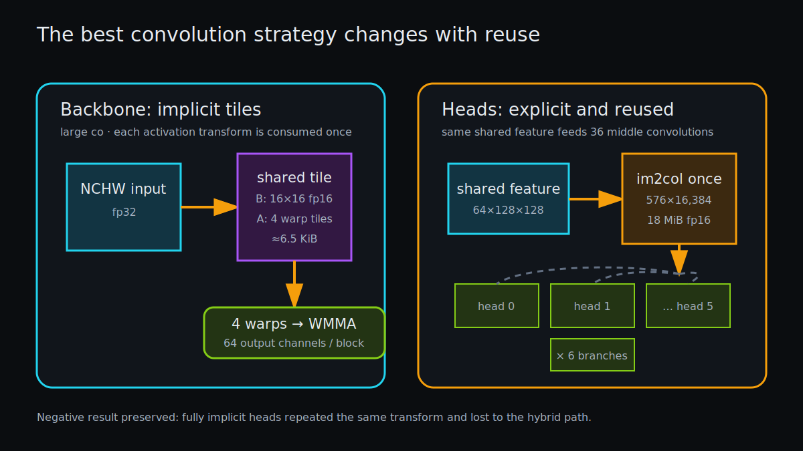

# The CUDA Path: One Graph, Two Convolution Strategies

> **Outcome.** The default CUDA backend evaluates the reference frame in a 57.50 ms warm mean on an RTX 4060 Ti. The backbone generates convolution tiles implicitly inside a four-warp WMMA block. The heads materialize one FP16 im2col matrix and reuse it across 36 middle convolutions. The mixed strategy wins because reuse, not ideology, decides whether materialization is waste.



*Large backbone layers avoid global im2col traffic; the multi-head fan-out deliberately materializes one transform and reuses it.*

## Persistent context

[`src/infer_cuda.cu`](../src/infer_cuda.cu) owns a singleton `Cache` containing device weights, activations, scratch buffers, compact candidates, and four timing events. On the first call it:

1. allocates every fixed-shape workspace;
2. uploads the 23.19 MiB fp32 model data;
3. converts the aligned data region to an 11.59 MiB FP16 mirror;
4. records raw branch offsets in constant memory.

No weight crosses PCIe on a warm frame. The model pointer is locked to the context; attempting to use a different mapped model fails rather than silently mixing addresses.

The default inference workspace is about 270.5 MiB. Compact detection lazily adds a 32.5 MiB worst-case candidate capacity. [The memory-residency page](07-pipeline-and-memory.md) accounts for the overlapping buffers.

## PFN and scatter

PFN assigns one CUDA thread to `(pillar, output_channel)`. That thread loops over 20 points and 11 features, accumulates in registers, and max-reduces locally. The input layout makes the 11 features contiguous for one point, but adjacent threads vary output channel first, so they reuse point features through cache while reading different tiny weight rows.

Scatter assigns threads across `64 × P`. For a fixed warp the mapping crosses output channels or pillar positions depending on `P`; writes target the dense NCHW canvas. A 64 MiB `cudaMemset` establishes zeros for empty cells before sparse writes.

CUDA events place this combined stage around `0.17 ms` on the reference frame. Earlier host timing included synchronization latency and reported a larger number; events measure device work between stage boundaries without forcing a barrier.

## Why explicit im2col was expensive

A 3×3 convolution can be viewed as matrix multiplication:

```text
W[co, ci×9] × Col[ci×9, h×w] → Y[co, h×w]
```

For the shared `384 → 64` convolution at `128 × 128`, `Col` has:

```text
3,456 × 16,384 fp16 = 108 MiB
```

Materializing it writes 108 MiB, then WMMA reads it. The original linear im2col kernel also recovered `(k, p)` using division and modulo from one flattened index. The current two-dimensional launch maps `blockIdx.y` directly to `k` and x threads to spatial positions, removing two large integer index operations from every element. `PP_CUDA_LEGACY_IM2COL=1` preserves the old mapping for A/B.

## Implicit WMMA in the backbone

`wmma_conv_implicit` launches 128 threads, or four warps. For each 16-wide K slice:

- all threads cooperatively assemble one 16×16 FP16 activation tile in shared memory;
- they assemble four padded 16×16 weight tiles, one per warp;
- each warp accumulates a distinct 16×16 output fragment with FP32 accumulators;
- four warps therefore cover 64 output channels while sharing the activation transform.

The shared arrays are roughly:

```text
B tile        256 half       = 0.5 KiB
4 A tiles   4×256 half       = 2.0 KiB
4 outputs   4×256 float      = 4.0 KiB
                                --------
                                ≈6.5 KiB/block
```

This keeps im2col bytes on chip. It does repeat activation construction across output-channel blocks when `co > 64`, but the measured balance beats a global materialization for backbone and shared layers.

## Why heads stay explicit

Every branch-middle convolution consumes the same `64 × 128 × 128` shared feature. There are six heads and six branches: 36 consumers. A single explicit matrix is:

```text
576 × 16,384 fp16 = 18 MiB
```

The runtime creates this matrix once in `colbig`, then `launch_precol` feeds it to all 36 WMMA calls. An all-implicit experiment rebuilt the same input tile per consumer and regressed head time. The hybrid path retained the winning half of each idea.

> **Negative result — fully implicit heads.** It reduced workspace traffic in isolation but destroyed cross-branch transform reuse. The default is hybrid; the discarded experiment is documented because "never materialize im2col" is not a universal rule.

## Tiny output heads and padding

Some final branches produce fewer than 16 channels. WMMA still works in 16×16 fragments, so inactive rows are padded in shared memory and guarded on output. This is tile quantization: fixed hardware tiles do extra work around small or irregular shapes. It helps explain why one universal kernel is not optimal across all 36 output convolutions.

## Deconvolution and precise mode

The two transposed-convolution kernels use one warp per output element and reduce input channels with shuffle operations. Since stride equals kernel size, each output position maps to one input position and one kernel tap—no overlapping output atomics.

`PP_CUDA_PRECISE=1` replaces WMMA with `direct_conv`. Eight warps per block each own one output element, reduce FP32 products across a warp, and write from lane zero. It is a correctness-first graph-equivalence path, not the throughput path.

## Stream ordering without host barriers

Four CUDA events bracket PFN/scatter, backbone/shared, and heads. The default stream preserves dependency order, while event timestamps avoid `cudaDeviceSynchronize` between stages. `PP_CUDA_SYNC_STAGES=1` restores those barriers for driver diagnosis and A/B.

The final raw copy or compact-count copy is synchronous and therefore closes the frame. Event timing remains device-side; `total_ms` remains host-observed latency including transfers and compact CPU decode.

## Optimization ladder

| Version | Mechanism | Observed effect | Tradeoff / fallback |
|---|---|---|---|
| FP32 direct | warp reduction | numerical reference | `PP_CUDA_PRECISE=1` |
| Explicit FP16 | im2col + WMMA | large speedup over direct | large global scratch |
| Persistent FP16 weights | convert once | major cold/warm separation | +11.59 MiB resident |
| 2D im2col | K as grid dimension | about 7% in same-binary A/B | legacy switch retained |
| Fully implicit | on-chip transform | faster backbone, slower heads | rejected globally |
| Hybrid | implicit backbone, reused explicit heads | best measured combination | shape-specific dispatch |
| CUDA events | remove stage barriers | small/noisy end-to-end gain | sync fallback retained |

## What to remember

- Avoiding memory traffic and maximizing reuse are the same goal viewed at different scopes.
- Shared memory is a software-managed cache; its value depends on how many consumers share the tile before eviction.
- Tensor cores accelerate the multiply, but index arithmetic, tiling, padding, launch count, and D2H transfer still belong to the performance model.

## What remains

Nsight hardware counters were unavailable in the measured WSL environment, so occupancy and bank-conflict explanations remain hypotheses rather than profiler claims. CUDA Graph capture and shape-specialized output heads are plausible next experiments, each requiring a switchable A/B and oracle validation.
