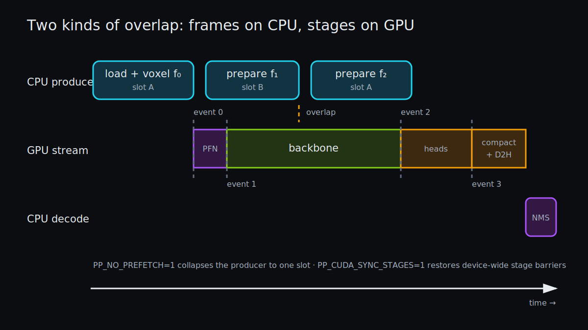
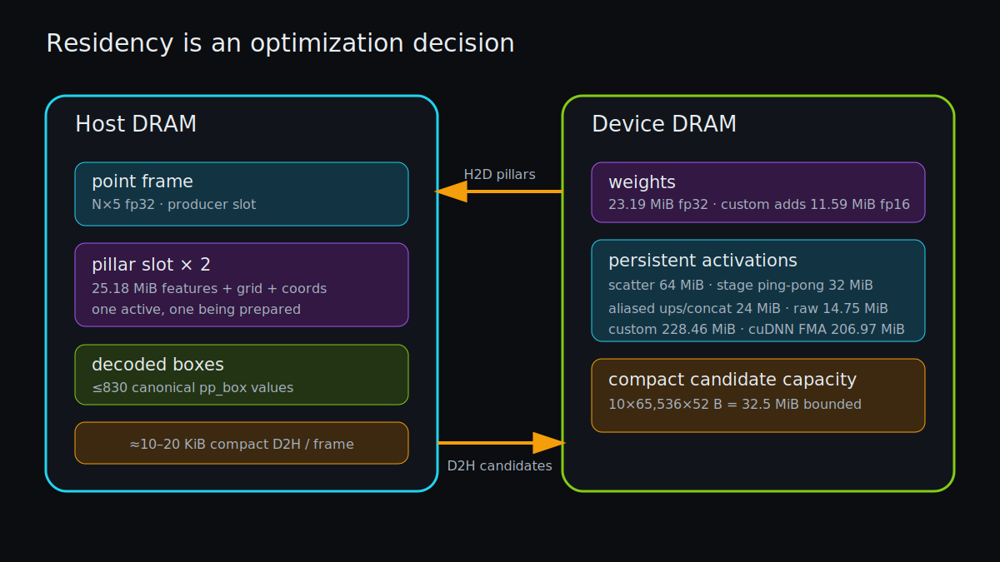

# End-to-End Pipeline: Latency, Throughput, and Peak Memory

> **Outcome.** Network latency is only one lane of the system. Batch mode overlaps next-frame loading and voxelization with current-frame CUDA work through a two-slot producer. CUDA keeps dense workspaces resident, uses events rather than stage barriers, and transfers compact candidates. The result is bounded memory, ordered output, and explicit switches for every speculative optimization.



*The producer advances one frame ahead while a single CUDA stream stays ordered by dependencies and measured by events.*

## CLI as an execution router

[`src/main.c`](../src/main.c) provides inspect, infer, benchmark, batch, and TUI modes with CPU/CUDA variants. The CLI is intentionally thin around the same runtime primitives:

```text
load → voxelize → infer → decode → serialize/render
```

Single-frame `infer-cuda` preserves full 14.75 MiB raw output because its `.ppout` file is an oracle artifact. Batch and TUI default to `pp_infer_cuda_detect`, where compact candidates replace the full D2H copy. One API should not silently weaken another API's output contract in the name of speed.

## The bounded producer

Batch mode creates `prep_pipe` with one or two `prep_slot` values. A slot owns a persistent `pp_pillars`, stats, frame index, preparation time, state, and error text. The worker:

1. waits until its modulo-selected slot is empty;
2. loads one file and voxelizes into that slot;
3. publishes state `ready` under a mutex and condition variable;
4. stops on the first error.

The consumer waits for frames in sorted filename order, runs inference and output, then marks the slot empty. Two slots bound lookahead to one frame and preserve deterministic ordering. `PP_NO_PREFETCH=1` reduces depth to one for memory-constrained systems or A/B.

The additional host cost is roughly one 27 MiB pillar workspace. In a same-binary 20-frame A/B, two-slot prefetch improved median wall time by about 2.6%; the exact gain varies with GPU clock and filesystem cache state.

## Host residency

Each active pillar slot owns:

- maximum feature arena: 25.18 MiB;
- coordinates: 0.46 MiB;
- point counts: 0.03 MiB;
- persistent grid: 1 MiB.

Point-file storage is exact-size and freed after voxelization. The decoded output allocation holds at most 1,000 `pp_box` entries in the CLI. Compact CUDA mode does not allocate the 14.75 MiB host raw-output arena for batch/TUI.

## Device residency



*Dense CNN weights and activation arenas stay resident; only sparse frame inputs and compact detections cross the boundary.*

The important live device allocations are:

| Allocation | MiB |
|---|---:|
| fp32 model | 23.19 |
| fp16 model mirror | 11.59 custom / none cuDNN |
| max input features | 25.18 |
| pillar output | 7.32 |
| scatter | 64.00 |
| stage ping-pong | 32.00 |
| aliased deblock / concatenated feature arena | 24.00 |
| shared + middle | 8.00 |
| raw heads | 14.75 |
| custom head im2col and smaller buffers | remainder |
| cuDNN selected-algorithm workspace | runtime-selected, bounded at 64 MiB by default |
| **custom raw inference total** | **228.46** |
| **cuDNN FMA raw inference total** | **206.97** |
| optional compact capacity | **+32.5** |

This accounting is capacity-based and excludes CUDA runtime/allocator reserve. It is still more honest than quoting model size alone: activation and transform workspaces dominate the 23 MiB checkpoint.

## Synchronization boundaries

Default execution uses one legacy CUDA stream, so data dependencies already impose order. Five events record PFN start/end, scatter end, backbone/shared end, and heads end. Stage times come from device event deltas after the final transfer synchronizes the frame. CUDA Graph experiments use the per-thread stream required for capture and report one combined dense interval rather than inventing an invalid internal boundary.

Earlier code used `cudaDeviceSynchronize` after every stage. Removing those host-visible barriers had a small and noisy throughput benefit, but it also makes the execution model cleaner: stage measurement no longer changes stage scheduling. `PP_CUDA_SYNC_STAGES=1` restores the old behavior.

## Cold versus warm

Cold custom CUDA includes device allocation, page commitment, FP32 upload, FP16 conversion, and lazy compact allocation. Cold cuDNN additionally creates descriptors, selects algorithms, grows a shared workspace, and loads library kernels. In the final 20-run raw reports, cold was 154.8 ms custom and 301.0 ms cuDNN, while warm medians were 44.397 and 12.993 ms. Both matter:

- interactive startup cares about cold latency;
- sustained batch/TUI throughput cares about warm latency;
- benchmark reports should never average them without saying so.

## Transfer boundary

Full raw output always transfers 15,104 KiB. Compact detection averaged roughly 10.5 KiB on the earlier 81-frame mini run and transferred about 20 KiB on the current perf fixture; candidate count legitimately varies by frame and backend numerics. The reduction is about three orders of magnitude. On cuDNN, where convolution is much faster, compact output changes the final warm median from 12.993 to 12.160 ms and is therefore a material part of the best path.

A persistent pinned staging experiment regressed slightly because it added an explicit host memcpy; it was removed. This negative result matters: a mechanism that improves bus bandwidth can still lose after counting the extra copy.

## Error propagation

- Allocation and thread initialization failures unwind owned slots.
- Worker load/voxel errors become slot state `error` and stop production.
- Malformed `.bin` size, empty directories, and non-`.bin` suffixes are rejected.
- Explicit CUDA requests fail when CUDA is unavailable.
- Batch exits nonzero on preparation, inference, decode, or serialization failure.

## What to remember

- Optimize throughput with a timeline, not a sum of isolated stage times.
- Queue depth is also a memory budget; two slots are enough to overlap one producer with one consumer.
- Persistent activation memory, not model size, sets the accelerator footprint.

## What remains

Dense CUDA Graph capture and six-branch grouped cuDNN heads were measured and kept opt-in because their total effects were flat. The next pipeline experiment is multi-frame execution: pinned sparse input and a second stream could overlap next-frame H2D/PFN work with late current-frame heads or compact decode, but it must include registration/copy cost and preserve bounded ordering.
