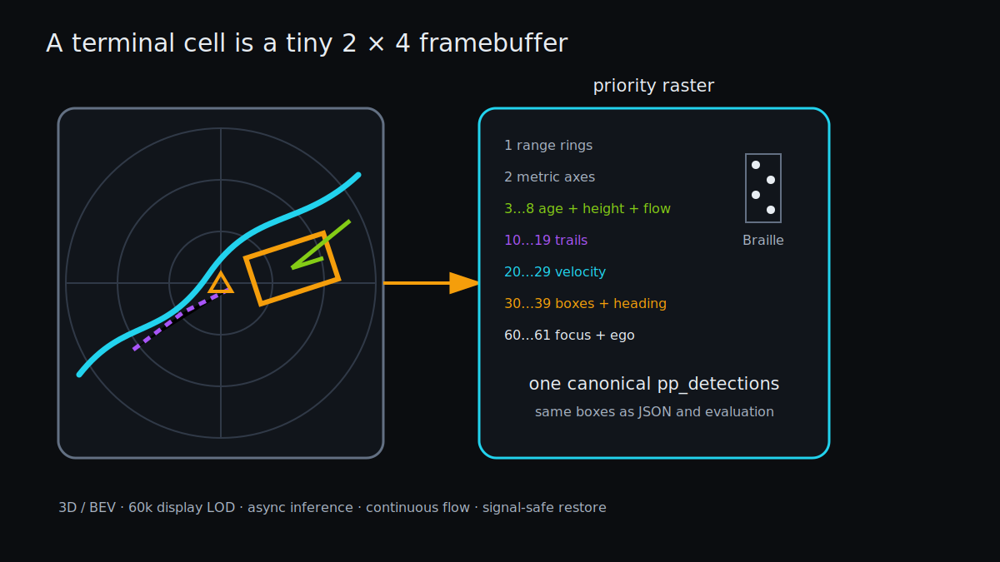

# The Terminal as a Point-Cloud UI

> **Outcome.** The TUI consumes the exact point tensor and `pp_detections` used
> by inference, then presents them as a flowing perspective point cloud or an
> aspect-correct metric BEV. Ten-sweep age, intensity, Z height, 3D boxes, and
> intermediate animation frames create motion without rerunning the model. The
> checked MP4 records this real ANSI output rather than a parallel mock.

[](../docs/pointpillars-tui.mp4)

*The full-width 3D canvas is the default; the object inspector and engineering
BEV remain one key away. Click to play the real 8-second capture.*



*A priority raster compresses metric layers into Unicode Braille while keeping class identity in ANSI color.*

## Why Braille

One Unicode Braille character encodes eight dots arranged as two columns by four rows. A terminal of `cols × rows` therefore presents a logical pixel grid of roughly:

```text
width  = 2 × cols
height = 4 × drawable_rows
```

[`pp_tui_compose`](../src/tui.c) allocates one byte per logical pixel, plots world geometry, then converts each 2×4 block to a Braille code point. This provides eight times the binary spatial resolution of one-character-per-point ASCII without curses or a graphics server. Its explicit `columns × rows` contract makes a frame deterministic and testable without owning a TTY. [`pp_tui_render`](../src/tui.c) only queries the live terminal size, composes, and performs a bounded `write` loop.

The renderer queries `TIOCGWINSZ` on every frame. The default camera projects
XYZ through a bounded perspective transform from behind and above the ego
vehicle. Z therefore changes screen height, and decoded boxes become eight
corner wireframes with vertical edges. Key `m` switches to the original
top-down BEV, whose shared metres-to-logical-pixels scale keeps 10 m circles
circular. Both projections apply the same pan, yaw, and zoom state. Off-screen
line clipping bounds work even under extreme camera movement.

The point cloud owns the full width by default. At 120×40 this expands the
logical canvas from `176×136` to `236×136`, a 34% horizontal-resolution gain.
Key `i` opens a 30-column inspector with per-class counts, filters, the selected
object, its local track, and camera state. The responsive header/footer remain
bounded; very small terminals show a resize message instead of corrupt output.

## Layer priority

The byte framebuffer stores the highest-priority mark at each pixel:

| Value | Layer |
|---:|---|
| 1 | 10 m range rings |
| 2 | forward/lateral axes |
| 3–8 | old/mid sweep, ground/low/high, and moving scan-highlight points |
| 10–19 | dim class-colored trails |
| 20–29 | class-colored velocity vectors |
| 30–39 | bright class-colored boxes and heading marks |
| 60–61 | selected target and ego vehicle |

This is a tiny z-buffer. Grid lines cannot erase points, and points cannot erase boxes. During Braille encoding, the highest value in a cell selects ANSI color while all occupied subpixels contribute to the glyph mask.

## Geometry layers

- Points use XYZ position. Z controls perspective height, sweep time controls
  age color, reflectance controls thinning, and a moving time/azimuth band
  creates the bright scan front.
- Rotated boxes use the decoded center, dimensions, yaw, and height to draw a
  3D wireframe; the heading stroke remains legible in BEV.
- Velocity draws from box center to `(x + vx, y + vy)`.
- Concentric range rings are drawn every 10 m with forward/lateral axes, then transformed with the view.
- Ego is a high-priority forward-facing triangular marker at world origin.

Class colors are stable across ten nuScenes classes. Keys `0`–`9` toggle class bits. `,` and `.` adjust the display score threshold from its uncluttered `0.20` default down to the actual `0.10` decode floor. `[` and `]` select among currently visible detections, and the status panel shows pose, dimensions, yaw, velocity, score, local track ID, and history age.

## Sweep flow without fake points

Prepared input contains up to ten sweeps with `time_lag` in feature five. Model
inference always consumes every point. After inference, the display path makes
an in-place, deterministic LOD of at most 60,000 real points: up to 30,000
current, 18,000 mid-age, and 12,000 old points, with unused quota redistributed.
The original and drawn counts remain visible in the HUD. Low-reflectance
current points receive one final stable thinning step. This matches the finite
terminal raster without random sparkle, interpolation, or invented points.

Inference runs in one background worker while the foreground polls at 16 ms
and continuously redraws the last complete result. A time-lag band advances
through the ten sweeps while a narrow azimuth highlight rotates across existing
points; a subtle perspective yaw adds parallax. A scripted real-data PTY run,
including its first frame and interactions, captured 96 ANSI frames at 25.0
fps. Key `f` freezes this motion for exact static inspection.

## Bounded tracking, not a hidden tracker product

`pp_tui_update_tracks` maintains at most 64 tracks with 12 XY samples each. Each new box chooses the nearest unused track of the same class within 5 m. Tracks tolerate three missed frames. Reverse navigation or a non-consecutive frame resets all history.

This is visualization state, not benchmark output or nuScenes tracking. The code deliberately avoids pretending nearest-neighbor association is a production tracker. Its bounds make memory and worst-case matching work explicit.

## Interaction map

| Key | Action |
|---|---|
| Space | play/pause |
| Left/`p`, Right/`n` | previous/next frame |
| `WASD` | pan |
| `z` / `e` | rotate |
| `+` / `-` | zoom |
| `m` | perspective 3D / metric BEV |
| `f` | animated sweep flow / static points |
| `i` | full-width canvas / inspector |
| `0`–`9`, `c` | toggle classes / restore all |
| `,` / `.` | score threshold |
| `[` / `]` | selected target |
| `l`, `b`, `v`, `g`, `t` | points, boxes, velocity, rings, trails |
| `h` / `?` | contextual help panel |
| `r`, `q` | reset view, quit |

Paused redraws reuse the current points and detections and freeze sweep flow;
they do not rerun inference. Frame navigation loads and evaluates the requested
frame, then updates tracking once.

## Terminal ownership and recovery

`pp_tui_begin` requires both stdin and stdout to be TTYs, saves termios, disables canonical input and echo, enters the alternate screen, hides the cursor, and installs signal handlers. `pp_tui_end` restores termios, style, cursor, and primary screen.

Signal handlers do not call complex terminal APIs. They set `sig_atomic_t` flags; the poll loop returns a quit or redraw action, and normal control flow performs restoration. SIGINT, SIGTERM, SIGHUP, SIGQUIT, and SIGTSTP request clean exit. SIGWINCH requests redraw.

PTY tests compare termios before and after signal exit and check the final ANSI
restore sequence. [`tests/test_tui.c`](../tests/test_tui.c) validates state
defaults, tracking, responsive bounds, 3D height sensitivity, BEV height
invariance, animated frame change, frozen determinism, inspector composition,
Braille emission, and byte-for-byte repeatability. ASan/UBSan also cover the
renderer and PTY lifecycle.

## One frame, one write

The renderer builds the complete ANSI frame in a growable buffer, changes SGR
state only when the winning pixel kind changes, and uses one `EINTR`-safe write
loop. Lifting camera trigonometry out of the point loop reduced 30 full
265,562-point perspective compositions to `4.75 ms/frame` without concurrent
inference. Runtime display LOD further bounds foreground work while the worker
processes the next full frame. Pixel and text buffers remain proportional to
terminal area; visualization state is fixed-size.

## Reproducible MP4

[`tools/record_tui.py`](../tools/record_tui.py) opens a 120×40 pseudo-terminal
and runs the real viewer over prepared nuScenes frames. It scripts 3D/BEV
switching, sweep-flow freeze, selection, zoom, rotation, pause, filters, help,
and layers; parses ANSI 256-color cells; rasterizes the actual Braille glyphs;
and streams raw RGB frames to H.264 through `ffmpeg`.

```sh
.venv/bin/python -m pip install Pillow
make tui-video PYTHON=.venv/bin/python \
  TUI_DATA=/data/nuscenes/pointpillars_10sweep
```

The checked macOS artifact comes from the native Accelerate backend over the
real 404-frame nuScenes mini preparation. It is 1200×720, 12 FPS, 8 seconds,
YUV420P/H.264, and 1.56 MiB. The selected poster is a full-width perspective
frame with 265,790 input points, 60,000 drawn points, sweep flow, Z-separated
structures, and 3D detections. Its poster and MP4 live under
`docs/` because they are README-facing documentation artifacts; transient
recording state never enters the repository. Exact hashes and the complete
local audit are in [the macOS + nuScenes mini chapter](13-local-macos-nuscenes-mini.md).

## What to remember

- Visualization should consume the canonical result representation, or it will eventually disagree with evaluation.
- A terminal can support meaningful metric interaction when pixel packing, physical aspect ratio, layer priority, and responsive information hierarchy are explicit.
- Terminal state is an owned resource. Recovery paths deserve tests just like memory mappings and CUDA buffers.

## Boundaries

The runtime remains dependency-free ANSI/Braille; Pillow and `ffmpeg` are used
only to produce documentation media. Perspective is a visualization camera,
not a second inference coordinate system, and `m` always restores metric BEV.
Terminals still quantize geometry to Braille dots, but full-width packing,
stable thinning, depth, age color, and temporal flow avoid presenting the
scene as a static wall of binary pixels.
