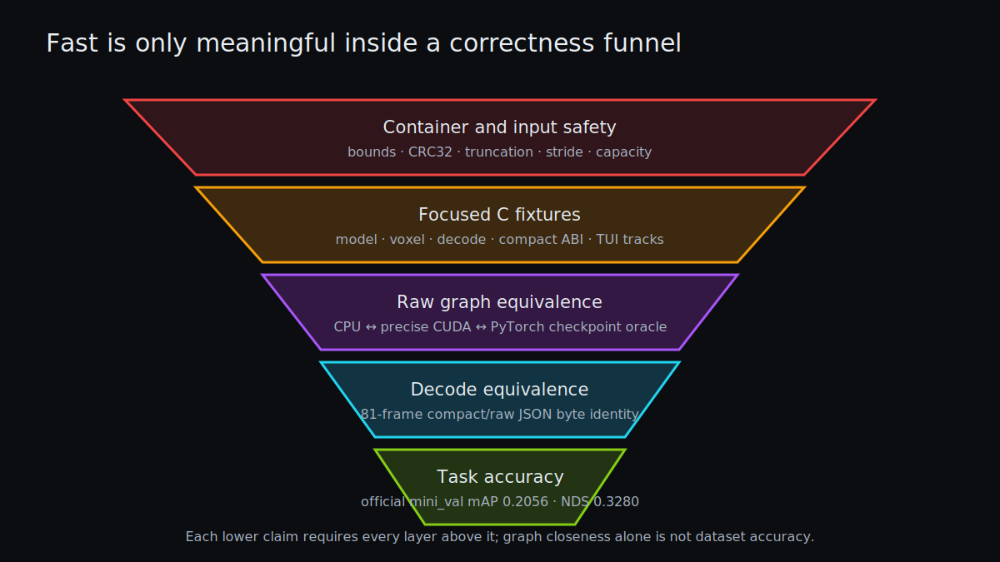

# Validation: From One Multiply to nuScenes NDS

> **Outcome.** The repository keeps five claims separate: bytes are safe to load, an operator matches a scalar oracle, a graph matches the checkpoint, compact output matches raw decode, and decoded boxes score on a named dataset split. A fast approximation cannot borrow credibility from a different rung.



*Every performance claim names the lowest boundary it preserves.*

## Focused native fixtures

`make test` builds small standalone programs:

| Test | Contract |
|---|---|
| [`test_model.c`](../tests/test_model.c) | 190 records, representative tensor shapes, mapped container |
| [`test_voxel.c`](../tests/test_voxel.c) | clipping, features, coordinates, zero padding across reuse |
| [`test_decode.c`](../tests/test_decode.c) | empty output, one candidate, compact/full decode equality |
| [`test_cpu_conv.c`](../tests/test_cpu_conv.c) | scalar-vs-AVX2/BNNS padding, stride-1/2, ReLU, plain heads, and Apple transposed convolution |
| [`test_tui.c`](../tests/test_tui.c) | track growth, jump reset, missed-frame expiry |

The CPU convolution fixture includes representative 64-channel shapes and observes at most `5.96e-7` error. Distinct nonzero exit codes localize failures without a test-framework dependency.

On Apple M2, BNNS 3×3 fixtures observe at most `3.58e-7`; the transposed
convolution fixture is exact. The full promoted Apple graph reports `6.51e-5`
maximum and `9.78e-7` mean absolute error against PyTorch. The faster all-BNNS
experiment fails at `2.12` maximum because of the 2×2/s2 shape and is therefore
opt-in rather than default.

`make portable-test` cleans and rebuilds the suite with `OMP=0`. Test binaries are rebuilt with the active flags, so an earlier non-OpenMP executable cannot be silently reused by a later OpenMP test.

## Focused cuDNN fixtures

```sh
make cudnn-test
```

[`tests/test_cudnn.cu`](../tests/test_cudnn.cu) constructs deterministic tensors without a checkpoint and compares:

- fused convolution+bias+ReLU to scalar C: `8.94e-8` maximum error;
- fused convolution+bias+identity to scalar C: `8.94e-8`;
- backward-data transposed convolution+bias+ReLU to scalar C: exact on the fixture.

This validates OIHW versus transposed `[ci,co,k,k]` indexing, output geometry, bias broadcasting, and activation independently from the full graph.

## Sanitizers

ASan/UBSan builds cover model, voxel, decode, CPU convolution, and TUI fixtures. They run without OpenMP to keep sanitizer diagnostics deterministic. Malformed-path tests include truncated model headers, invalid point-file sizes, and empty input directories.

## Direct checkpoint oracle

[`tools/oracle_checkpoint.py`](../tools/oracle_checkpoint.py) executes the checkpoint directly in PyTorch with TF32 disabled. It independently recreates voxel features, PFN, scatter, all backbone/deblock/shared layers, and 36 branch pairs, then concatenates raw planes in runtime order.

Run every strict backend explicitly:

```sh
make checkpoint-oracle
make checkpoint-oracle-ggml
make checkpoint-oracle-cuda
make checkpoint-oracle-cudnn
```

Final measured results are:

| Backend | Maximum absolute error | Mean absolute error | Gate |
|---|---:|---:|---|
| native CPU | `9.890e-4` | `1.060e-5` | allclose |
| GGML hybrid | `9.632e-4` | `1.119e-5` | allclose |
| custom precise CUDA | `6.523e-4` | `5.777e-6` | allclose |
| cuDNN FMA | `4.997e-4` | `5.364e-6` | allclose |

The declared gate is `rtol=2e-4, atol=2e-3`. All four commands now sort the prepared-frame list and use the same first fixture; the perf JSON additionally records its point hash.

## The custom FP16 path is an explicit approximation

Custom WMMA uses FP16 weights/activation tiles with FP32 accumulation. On the perf frame it reports approximately:

```text
max_abs  ≈ 0.786
mean_abs ≈ 0.006
allclose = False
```

It also changes one decoded score-threshold-edge box relative to strict CPU/cuDNN. Its optimized fast variants are byte-identical to their same-math fallbacks, but that only proves the optimization did not add a new error. The backend's validity claim comes from its named task evaluation, not from the strict graph oracle.

cuDNN defaults to FP32 `CUDNN_FMA_MATH`. `PP_CUDNN_TF32=1` is separately approximate and fails the raw gate at about `0.092` maximum error, so it is not promoted by default.

## Decode equivalence

Compact CUDA does not return all raw planes. Its appropriate gate is decoded identity:

```sh
PP_CUDA_RAW_DECODE=1  # full 15,104 KiB D2H, then canonical decode
# default batch/TUI       compact candidates, then the same canonical decode
```

Custom compact/full JSON was compared byte-for-byte over 81 mini frames. cuDNN compact and full-raw modes are byte-identical on the controlled perf frame. This covers candidate thresholding, branch offsets, code packing, D2H ordering, residual reconstruction, and rotated NMS together.

Compact D2H volume depends on the number of score-qualified candidates. It was about 20 KiB on the current perf frame; a byte difference in transfer volume between strict and approximate backends is not itself a decode mismatch.

## Same-binary differential switches

```sh
PP_CPU_OC4=1                 # narrower stride-one CPU kernel
PP_CPU_S2OC4=1               # narrower stride-two CPU kernel
PP_CPU_PLAIN_ACCUM=1         # old final-head accumulation
PP_GGML_DISABLE=1            # native CPU inside GGML binary
PP_APPLE_DISABLE=1           # portable C inside the macOS binary
PP_APPLE_CONV2=1             # reproduce rejected approximate BNNS 2x2/s2
PP_CUDA_EXPLICIT=1           # custom explicit im2col
PP_CUDA_EXPLICIT_OUTPUTS=1   # explicit final-head transforms
PP_CUDA_PRECISE=1            # custom direct FP32 convolution
PP_CUDA_SYNC_STAGES=1        # synchronization at profile boundaries
PP_CUDNN_DISABLE=1           # custom CUDA inside cuDNN binary
PP_CUDNN_TF32=1              # explicit reduced-precision experiment
```

The cuDNN binary with `PP_CUDNN_DISABLE=1` produces a raw file byte-identical to the standalone custom CUDA binary. Two independent default cuDNN processes also produce byte-identical raw files.

## Official task accuracy

[`tools/make_submission.py`](../tools/make_submission.py) transforms lidar-frame boxes and velocities through calibrated sensor/ego/global poses into the official nuScenes schema. [`tools/evaluate_nuscenes.py`](../tools/evaluate_nuscenes.py) invokes the official detector evaluator.

The checked-in [`metrics_summary.json`](../evaluation/nuscenes-mini/metrics_summary.json) records the custom fast path on the local 81-frame `mini_val` split. A final cuDNN FMA run processed all 404 prepared frames, generated the same 81 validation samples, and ran the same official evaluator:

| Metric | custom FP16-WMMA | cuDNN FMA |
|---|---:|---:|
| mAP | 0.20557 | 0.205512 |
| NDS | 0.32804 | 0.327992 |
| translation error | 0.52881 | 0.52879 |
| scale error | 0.53181 | 0.53182 |
| orientation error | 0.61572 | 0.61581 |
| velocity error | 0.56981 | 0.56990 |

The checkpoint filename's `5823` refers to a different/full evaluation context and cannot be compared directly with this mini split. Any newly promoted approximate math mode must rerun the same named evaluation.

## Performance reports are also validation artifacts

[`tools/perf.py`](../tools/perf.py) records model/frame/binary hashes, fixture statistics, machine and library identity, thread/runtime environment, every run, output mode, workspace, and D2H bytes. Its comparator rejects incompatible reports and can fail latency, workspace-growth, and transfer-growth gates.

A publication claim should always state:

- point and live-pillar count;
- CPU/GPU identity and thread topology;
- strict or approximate math mode;
- cold call separately from warm statistic;
- raw or compact output boundary;
- capacity and transfer volume;
- correctness rung passed by the same code.

Nsight Compute hardware counters were unavailable under WSL (`ERR_NVGPUCTRPERM`). CUDA events and same-binary switches support timing claims; no occupancy, cache-hit, or shared-bank number is invented.

## What to remember

- Operator equality, graph allclose, decoded identity, and task accuracy answer different questions.
- A benchmark without its output boundary can hide 15 MiB of transfer or CPU postprocessing.
- Passing a precise fallback does not validate an approximate default.
- Negative accuracy evidence is a result: it prevents unsafe quantization or TF32 from becoming implicit.

## What remains

Future low-bit or reduced-precision graph work needs saved calibration/operator tensors and its own official task-evaluation report before promotion. Strict raw equivalence is necessary, but threshold and NMS behavior still deserve this final dataset-level gate.
