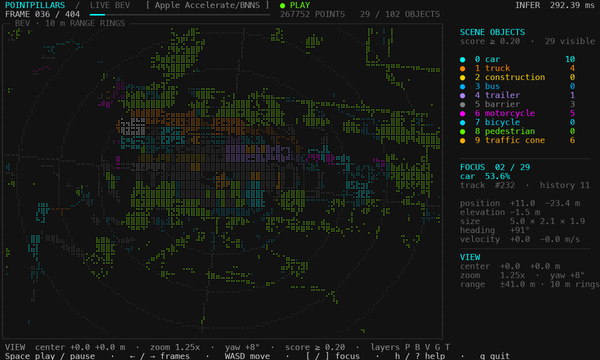
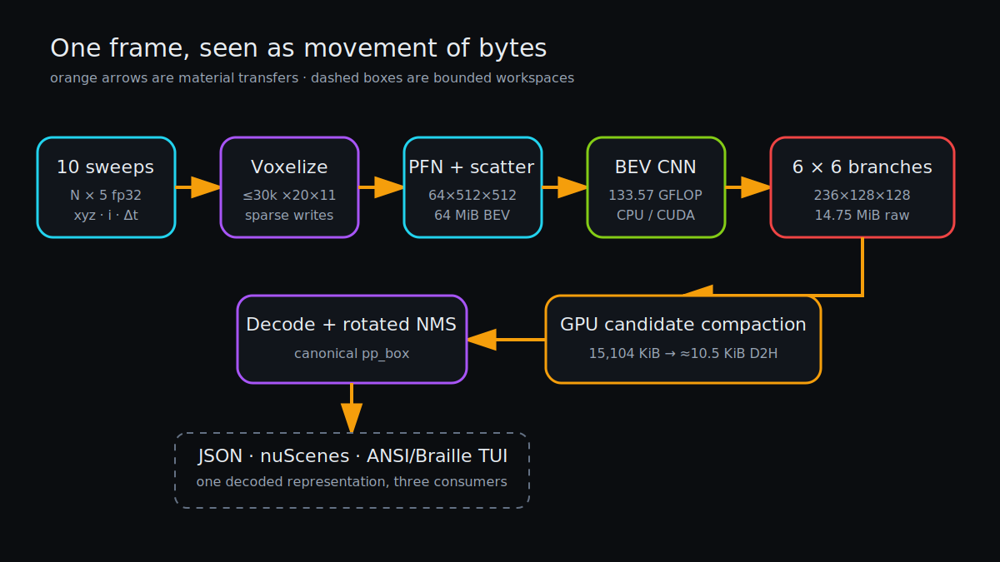

# PointPillars.c: An Inference Engine Seen Through Its Memory Traffic

> **Outcome.** The base repository executes a native OpenPCDet nuScenes PointPillars MultiHead checkpoint in dependency-free C11, with optional pinned GGML, custom CUDA, and strict-FP32 cuDNN builds. The central story is how a frozen graph moves sparse points into a 64 MiB BEV canvas, 133.57 GFLOP of dense convolution, 36 prediction branches, a bounded output transfer, rotated NMS, and an interactive terminal renderer.

[](../docs/pointpillars-tui.mp4)

*Click the preview to play the real terminal session: responsive metric BEV,
selection, filters, trails, camera controls, and live backend timing.*

The same runtime now builds natively on macOS. Apple Silicon dispatches
oracle-safe convolution shapes to Accelerate/BNNS, keeps the rejected 2×2/s2
shape on canonical C, and requires no third-party OpenMP runtime.



*Each speedup changes residency, representation, reuse, or the host/device boundary; no backend is allowed to change the model contract silently.*

## The measured performance ladder

The table uses one 26,414-point, 7,854-pillar fixture on an i5-14600KF / RTX 4060 Ti environment. Every row is a 20-run JSON report; run zero is cold and excluded from the warm median. CPU convenience rows use 16 workers, while the host-tuned row uses the measured 32-worker optimum. CUDA raw transfers all 3,866,624 output floats; compact includes candidate compaction, about 20 KiB D2H, canonical decode, and NMS.

| Path | Warm median | Effective graph rate | Capacity | Correctness boundary |
|---|---:|---:|---:|---|
| native CPU, 16 threads | 468.816 ms | 0.285 TFLOP/s | 129.92 MiB | PyTorch allclose |
| GGML hybrid CPU, 16 threads | 458.973 ms | 0.291 TFLOP/s | 147.92 MiB | max abs `9.632e-4` |
| native CPU, tuned 32 workers | 410.406 ms | 0.325 TFLOP/s | 129.92 MiB | max abs `9.890e-4` |
| custom WMMA CUDA raw | 44.397 ms | 3.009 TFLOP/s | 228.46 MiB | approximate/task-accuracy path |
| custom WMMA CUDA compact | 44.104 ms | 3.030 TFLOP/s | 260.96 MiB | decoded output contract |
| cuDNN FMA raw | 12.993 ms | 10.280 TFLOP/s | 206.97 MiB | max abs `4.997e-4` |
| cuDNN FMA compact | 12.160 ms | 10.984 TFLOP/s | 239.47 MiB | raw oracle + decoded identity |

Effective rate divides a source-derived 133.57 GFLOP by end-to-end latency. It is a comparison for this graph, not a hardware-counter claim. Compact rows include postprocessing, so their “rate” is deliberately conservative.

The custom FP16-WMMA path is not graph-equivalent: on the perf frame it has about `0.786` maximum raw error and changes one threshold-edge box. CPU, custom precise CUDA, and cuDNN FMA are the strict graph-equivalence routes. Approximate CUDA retains the checked-in task-evaluation claim instead of borrowing the precise backend's oracle result.

The Apple M2 report uses a separate deterministic 24,000-point / 7,881-pillar
fixture, so it is not mixed into the WSL table. The strict Accelerate hybrid
reduced warm median from `7017.255 ms` to `249.490 ms` (`28.1×`) and passed the
checkpoint oracle at `6.51e-5` maximum absolute error. See the dedicated
[macOS and Apple Silicon chapter](12-macos-apple-silicon.md).

A second Apple M2 audit uses a real 265,562-point, ten-sweep nuScenes mini
frame: `302.983 ms` warm median, `8.96e-4` oracle maximum error, and 404/404
successful CPU batch outputs. The full evidence and `/data` setup are in the
[local macOS + nuScenes mini chapter](13-local-macos-nuscenes-mini.md).

## Read this like a worklog

1. [The frozen model contract](01-model-contract.md) — shapes, layouts, classes, and why specialization is legitimate.
2. [From ten sweeps to pillars](02-voxelization.md) — sparse indexing, cache lines, and bounded clearing.
3. [A 23 MiB mapped model container](03-model-container.md) — offline folding, aligned records, CRCs, and zero-copy ownership.
4. [The CPU path](04-cpu-inference.md) — eight-channel AVX2 reuse, direct heads, thread topology, selective GGML, and rejected INT8.
5. [The CUDA path](05-cuda-inference.md) — custom WMMA, strict cuDNN, transposed convolution, Graph A/B, and math-mode gates.
6. [Decode and rotated NMS](06-decode-and-nms.md) — early logit filtering and one canonical box representation.
7. [The whole pipeline](07-pipeline-and-memory.md) — bounded double buffering, cold/warm latency, peak memory, and compact transfer.
8. [The terminal as a point-cloud UI](08-terminal-visualizer.md) — Braille pixels, metric layers, tracking, and terminal recovery.
9. [The correctness funnel](09-validation.md) — scalar fixtures, graph oracles, decoded identity, and official nuScenes evaluation.
10. [Extension map](10-extension-guide.md) — where to add a backend, operator, output format, or visualization without breaking the contract.
11. [Performance workflow](11-performance-workflow.md) — the complete measure/change/prove sequence, results, and negative experiments.
12. [macOS and Apple Silicon](12-macos-apple-silicon.md) — native build, BNNS plan caching, the strict shape gate, and M2 evidence.
13. [Local macOS + nuScenes mini](13-local-macos-nuscenes-mini.md) — extraction, real ten-sweep data, every local workflow, official metrics, and checked TUI media.

## Repository map

| Area | Role |
|---|---|
| [`src/voxel.c`](../src/voxel.c) | deterministic file loading and pillar features |
| [`src/model.c`](../src/model.c) | mapped, bounds-checked FP32 model container |
| [`src/infer_cpu.c`](../src/infer_cpu.c) | complete C11/OpenMP/AVX2 and portable fallback backend |
| [`src/infer_apple.c`](../src/infer_apple.c) | cached Accelerate/BNNS convolution adapter |
| [`src/infer_ggml.c`](../src/infer_ggml.c) | optional two-shape zero-copy GGML accelerator |
| [`src/infer_cuda.cu`](../src/infer_cuda.cu) | persistent CUDA graph and custom kernels |
| [`src/infer_cudnn.cu`](../src/infer_cudnn.cu) | optional cached FP32 cuDNN convolution plans |
| [`src/decode.c`](../src/decode.c) | score filtering, residual decode, rotated NMS |
| [`src/main.c`](../src/main.c) | CLI, perf modes, bounded preprocessing pipeline |
| [`tools/perf.py`](../tools/perf.py) | identified cold/warm reports and regression gates |
| [`tools/record_tui.py`](../tools/record_tui.py) | portable PTY capture and H.264 demo generation |
| [`tools/`](../tools) | export, checkpoint oracle, data preparation, evaluation |
| [`tests/`](../tests) | scalar/operator and runtime-contract fixtures |

## Reproduce the reports

```sh
make model
make
make ggml
make cuda
make cudnn

frame=$(find /data/nuscenes/pointpillars_10sweep \
  -name '*.bin' -type f | sort | head -1)

make perf-cpu PERF_FRAME="$frame" PERF_REPS=20 PERF_THREADS=16
make perf-ggml PERF_FRAME="$frame" PERF_REPS=20 PERF_THREADS=16
make perf-cuda PERF_FRAME="$frame" PERF_REPS=20
make perf-cuda-compact PERF_FRAME="$frame" PERF_REPS=20
make perf-cudnn PERF_FRAME="$frame" PERF_REPS=20
make perf-cudnn-compact PERF_FRAME="$frame" PERF_REPS=20
```

The first call remains in every report. Custom CUDA cold includes context creation, allocation, upload, and FP16 conversion. cuDNN cold additionally creates descriptors and algorithms. Warm distributions begin only after the configured warmup count.

## What to remember

- The graph becomes dense after scatter, so bounded resident activation arenas dominate weight-streaming tricks.
- CPU and GPU need different representations; even one backend needs different strategies for stride, channel count, and fan-out.
- GGUF is a container, GGML is a set of operators, and cuDNN is a primitive provider; none is automatically an end-to-end win.
- Correctness is a ladder: container safety, scalar operator fixtures, raw graph equivalence, decoded identity, then named task accuracy.
- Cold latency, warm latency, capacity, D2H bytes, and output contract are separate axes.

## Remaining evidence gaps

Nsight Compute counters are unavailable in the measured WSL environment, so no occupancy or cache-hit claims are invented. Future CPU packing, cuDNN frontend fusion, multi-frame GPU execution, and calibrated quantization must beat the documented native 410.406 ms CPU or 12.160 ms compact CUDA baselines under the same protocol.
